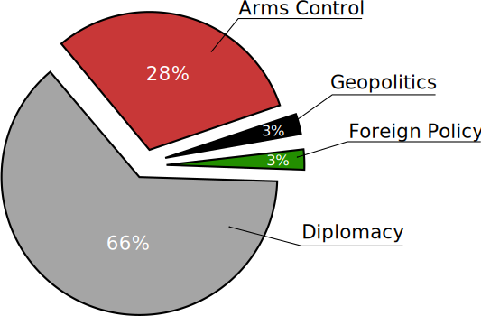
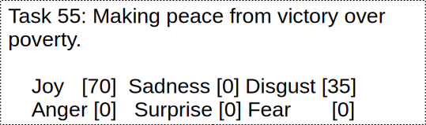
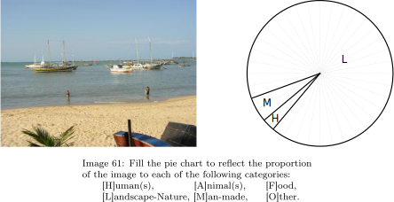
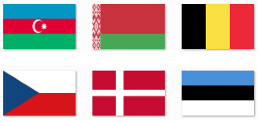
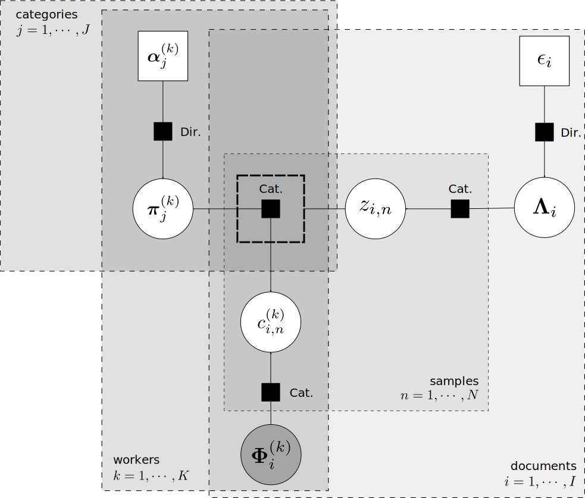

= Bayesian Aggregation of Categorical Distributions with Applications in Crowdsourcing
Alexandry Augustin, Matteo Venanzi, Alex Rogers, Nicholas R. Jennings
:toc: preamble
:stem: latexmath

:url-semeval-2007: https://web.eecs.umich.edu/~mihalcea/affectivetext/
:url-iapr-tc12: https://www.imageclef.org/SIAPRdata
:url-bbc-article: https://www.bbc.co.uk/news/world-asia-40913650
:url-infer-net: https://dotnet.github.io/infer/
:url-infer-net-download: https://dotnet.github.io/infer/download.html
:url-vscode: https://code.visualstudio.com/
:url-vscode-download: https://code.visualstudio.com/Download
:url-ibcc-paper: http://proceedings.mlr.press/v22/kim12.html

This repository contains the code, manuscript, datasets, and other materials accompanying our work published as a https://www.ijcai.org/Proceedings/2017/0195[research paper] to the International Joint Conferences on Artificial Intelligence (IJCAI). 

== Motivation

Consider the following exemplar news article:

[.text-center]
[#news-article]
.Source: {url-bbc-article}[BBC News, 2017].

Although the title may give us a coarse indication of the content of the article (e.g. Politics), a careful reading of the text reveals that about 66% of the article is about Diplomacy, 28% about Arms Control, 3% about Geopolitics, and 3% about Foreign Policy.

[.text-center]
[#motivating-example]
.Example judgment of proportions.

Such categorisation is valuable in areas such as information retrieval and recommendation as it allows for finer grained searches and organisation than classifications into single categories. 
Other examples may include the labelling of proportions of sentiments (e.g. surprise or joy), or the labelling of images when multiple objects are present at the same time.

Despite years of advances in automated classification, humans are still better on such tasks.
As a result, crowdsourcing has increasingly been a popular way to leverages human annotators of various abilities and domain experience to perform tasks that would be too difficult or expensive to process computationally or using experts, but would only require simple instructions to complete. 

However, collecting reliable judgments from unknown members of a crowd (also called workers) remains a challenging task. 
It is well known that crowdsourcing platforms suffers from malicious participants (also called spammers) which provide judgments randomly regardless of the document. Such spammers can constitute up to 45% of the population of workers. 
This increases the cost of acquiring judgments and degrade accuracy of the aggregation.

In this present work, we introduce a new method to aggregate judgments of proportions across multiple categories that for the first time accounts for spammers. 

== The Datasets

This repository uses a total of three datasets to evaluate accuracy, including two novel crowdsourced judgments for a total of 796 annotations about proportions of objects in images and colours in countries flags.

* *SemEval-2007.* Each worker was presented with a list of news headlines and was asked to give numeric judgments between zero and a hundred for each of six sentiments. 
A total of 1,000 judgments are available accross 100 news headlines.

[.text-center]
[#img-semeval-example]
.Example of annotated news headline taken from the SemEval2007 dataset.

* *IAPR-TC12.* Each worker were presented with images and was asked to estimate the proportion of each of the six regions in it (e.g. landscape/nature or man-made). 
We collected a total of 336 judgments from a set of 16 images. 

[.text-center]
[#img-IAPR-TC12-example]
.Example of a judgment in a rural scene from the IAPR-TC12 dataset performed with a pie chart.

* *Colours.* Twenty-three participants were asked to judge the proportion of 10 colours in 20 countries' flag. 
We crowdsourced a total of 460 judgments of proportion.

[.text-center]
[#img-colours-example]
.Example of flags taken from the Colours dataset.

== Our Model

Our proposed model (that we call _multi-category independent Bayesian classifier combination_, or MBCC for short) builds on the strength of prior approaches to deal with aggregating distributions while at the same time accounting for spammers. 
In particular, we extend {url-ibcc-paper}[IBCC], and associate with each document a categorical distribution representing the proportions of each category.

The factor graph below illustrates the generative process (that is, the process by which our model assumes the judgments of proportions from the workers have been generated) that learns both the proportions per document, and the accuracy of each worker. This is a typical factor graph where each node represent a random variable and each connection a probabilistic conditional dependency. 

[.text-center]
[#img-mbcc-fg]
.Factor graph of MBCC.

. we start by sampling a confusion matrix for each worker. Each row latexmath:[\pi] of a confusion matrix is distributed according to a Dirichlet distribution with hyperparameter latexmath:[\alpha].

. we then sample a categorical distribution latexmath:[\Lambda] for each document, which represent the aggregated judgment of the proportion by all workers. This categorical distribution latexmath:[\Lambda] is similarly drawn from a Dirichlet prior with hyperparameter latexmath:[\epsilon].

. we then repeateadly sample this distribution latexmath:[\lambda] latexmath:[\n] times to obtain multiple discrete categories latexmath:[z].

. we then use those samples latexmath:[\z] as index of the workers' confusion matrix latexmath:[\pi], and samples discrete judgments latexmath:[\c] from the appropriate row of the confusion matrix of each worker.

. finally, we find the most likely categorical distributions \Phi which generated the samples latexmath:[\c] for all documents and workers.

== Software Implementation

All source code used to generate the results and figures in the paper are in the `src` directory. 
The data used in this study is provided in `data` and the sources for the manuscript text and figures are in `manuscript`. 
The poster and presentation can be found in `poster/poster.pdf` and `poster/presentation.pdf` respectively.

=== Getting the code

You can download a copy of all the files in this repository by cloning the git repository:

....
git clone https://github.com/alexandry-augustin/mbcc.git
....

or https://github.com/alexandry-augustin/mbcc/archive/master.zip[download a zip archive].

=== Dependencies

You'll need a working https://www.python.org/[Python] environment and the {url-infer-net}[Infer.NET] library to run the code. 

== Citation

If you use our code or dataset, please cite as follows:

....
@inproceedings{augustin2017bayesian,
  title={Bayesian aggregation of categorical distributions with applications in crowdsourcing},
  author={Augustin, Alexandry and Venanzi, Matteo and Hare, J and Rogers, A and Jennings, NR},
  year={2017},
  organization={AAAI Press/International Joint Conferences on Artificial Intelligence}
}
....

== License

All source code is made available under the MIT license. 
You can freely use and modify the code, without warranty, so long as you provide attribution to the authors. 
See link:./LICENSE[LICENSE] for the full license text.

The manuscript text is not open source. 
The authors reserve the rights to the article content, which has been published in the proceedings of the International Joint Conference on Artificial Intelligence (IJCAI).
